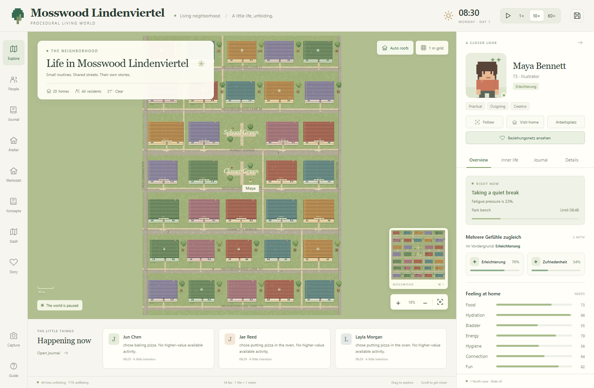

# Open Sims · Mosswood

A small, persistent neighborhood built from the supplied **Procedural Living Worlds** and **Living World Model** whitepapers. Python runs 44 residents across 20 households; an original pixel-art canvas lets you watch their lives, explore their homes, and inspect the reasons for their decisions. No language model, API key, Simulation Field, frontend build, or asset download is needed.



This repository is a research prototype, not a finished game. The inhabited neighborhood, resident routines, observer UI, event ledger, and persistence are implemented. The multi-floor house/room generator, district planner, and content-agent workshop are separate laboratories; they do **not** yet populate or replace the live world. Pupil attendance, agentic self-improvement, and the full Living World Model protocol remain planned work.

Start with the [documentation index](docs/README.md) for architecture, APIs, design papers, HTML supplements, testing, and known gaps. The two source whitepapers are included as [Procedural Living Worlds](Procedural_Living_Worlds_Whitepaper.pdf) and [Living World Model](Living_World_Model_Technical_Report%20%282%29.pdf).

## Quick start from a fresh clone

Requires Python 3.11+ on Windows, macOS, or Linux. The frontend is plain JavaScript/Canvas; no Node build or model key is needed.

```powershell
python -m venv .venv
.venv\Scripts\python -m pip install -r requirements.txt
.venv\Scripts\python run.py --layout neighborhood-v1 --seed 73
```

On macOS/Linux, use `.venv/bin/python` instead of `.venv\Scripts\python`. Open <http://127.0.0.1:8765/>; API docs are at <http://127.0.0.1:8765/docs>. The command creates a **new** local world in `data/mosswood.sqlite3`. To create the separately named, paused Lindenviertel save shown in the historical screenshots, run the following **once** before starting its server:

```powershell
.venv\Scripts\python scripts/create_lindenviertel.py
.venv\Scripts\python run.py --database data/mosswood-lindenviertel-20260929.sqlite3 --layout neighborhood-v1 --seed 73 --port 8769
```

Do not start two servers against the same SQLite file. Existing saves are never overwritten by the Lindenviertel creator. The `data/` directory and credentials are deliberately excluded from Git; screenshots and JSON verification evidence under `artifacts/` are included. To reproduce tests, see [Verification](docs/verification.md) and the commands below. No license has been selected yet; do not assume permission for reuse or redistribution beyond GitHub's standard viewing/forking terms.

## Start

**Lindenviertel auf Port 8769** ist ein separater bewohnter Spielstand mit neuer Karte, 20 Haushalten und sämtlichen implementierten Story-Systemen. Auf Windows startet **Start Lindenviertel.bat** ihn; in einem frischen Clone wird die Datenbank dabei zuerst erzeugt. Die [HTML-Dokumentation](docs/story_systems.html) erklärt gleichzeitige Gefühle, Ursachen/Selbstdeutung, Beziehungen, Rezepte, Kleidung und Stadtplanung. Bestehende Welten werden nicht überschrieben. Mehrere Server dürfen niemals dieselbe Weltdatenbank verwenden.

```powershell
python run.py --database data/mosswood-lindenviertel-20260929.sqlite3 --layout neighborhood-v1 --seed 73 --port 8769
```

Die aktive neue Karte besitzt echte Innenräume und Arbeitsplätze auf einer Ebene. Das mehrstöckige Gebäude- und Stadtplanungslabor ist weiterhin separat über Atelier/Werkstatt/Stadt erreichbar. Beim Laden wird die gespeicherte Karte einschließlich Navigation wiederhergestellt, nicht erneut generiert. `scripts/create_lindenviertel.py` erzeugt den eigenen Startspielstand nur, wenn seine Datei noch nicht existiert.

Abnahme: [korrigierter Seed-73-Testtag](artifacts/lindenviertel/seed73-after-urgency-fix.json), [zehn Browserprüfungen einschließlich Mobilansicht](artifacts/lindenviertel/ui-smoke.json) und [Erzeugung/Wiederladen des Spielstands](artifacts/lindenviertel/creation.json). Die Berichte sind Momentaufnahmen bestimmter Codeversionen, keine Garantie für andere Maschinen. Bei bereits laufendem Server den Browserlink verwenden, keinen zweiten Server für dieselbe Datenbank starten.

Python 3.11 or newer is required. From this directory:

```powershell
python -m venv .venv
.venv\Scripts\python -m pip install -r requirements.txt
.venv\Scripts\python run.py
```

Open **http://127.0.0.1:8765**. The launcher also opens your default browser. If your existing Python already has the dependencies, `python run.py` or **Start Mosswood.bat** works directly. The batch file uses your PATH Python; activate the virtual environment first if you installed into `.venv`.

```powershell
python run.py --no-browser --port 8765
python run.py --database data/another-neighborhood.sqlite3 --seed 73
```

The server binds to localhost. One Python process owns the world; use a single Uvicorn worker. All open browsers watch the same simulation and share its time controls. It keeps running while the server runs, including when browser tabs close. Shutting down the server suspends world time. OS suspension does not trigger an overnight catch-up.

Accepted history and the current scheduler checkpoint are saved together to `data/mosswood.sqlite3` every ten real seconds, on **Save**, and on graceful shutdown. A crash can lose the uncheckpointed tail, at most about ten real seconds. Restarting resumes the saved world. Opening a different `--database` creates a separate world; there is no destructive reset button.

## Explore

Neu: **Objekte** öffnet eine durchsuchbare Objektliste; sichtbare Möbel sind direkt auf der Karte anklickbar. Der Explorer zeigt echte Zustände, Reservierungen, Nutzer, Anker und Aktionsarten. `GET /api/objects/{oid}` liefert zusätzlich konkrete Containerinhalte. Ein älterer laufender Server nutzt bis zum Neustart eine ausdrücklich markierte Leseprojektion über `/api/world`.

Das Tempo-Menü bietet **1× / 10× / 60× / 120× / 300× / 600×**. Tempoauswahl bewahrt die Pause; Play startet. Höhere Werte sind angeforderte Faktoren, keine garantierte Rechenleistung. Der [HTML-Ausbauplan](web/plausibility-plan.html) beschreibt Schulbetrieb, gemeinsame Generatorverträge, beobachtungsbasierte Agentenschleife und ein umfassendes Interventionsmenü. Diese geplanten Systeme wurden noch nicht implementiert.

| Control | What it does |
| --- | --- |
| Drag, WASD, arrow keys | Pan the map |
| Wheel, pinch, + / − | Zoom around the pointer |
| F, fit button, minimap | Find your way around |
| Click a person | Inspect that resident |
| Click visible furniture / Objects | Inspect physical object state and capabilities |
| Click a house | Select its household and see inside |
| People / P | Search all residents and addresses |
| Follow / Visit home | Follow a resident or inspect their home |
| R | Cycle automatic, open, and closed roofs |
| G | One-meter grid, footprints, and interaction anchors |
| Space | Pause or resume |
| Speed menu: 1× to 600× | Requested world seconds per real second; keeps pause state |
| Guide → advance a minute | Pause, then process 60 world seconds |
| Camera | Download the rendered map as PNG |

The inspector has four tabs:

- **Overview:** active action, need satisfaction, current thought, and goals.
- **Inner life:** explicit emotion appraisal, committed intentions versus possible next actions, relationships, beliefs, evidence, and memories.
- **Journal:** readable accepted events, rule IDs, reasons, and causal parent references.
- **Details:** exact location, inventory, money, skills, work schedule, current object footprint and reservation, scored alternatives, preferences, modeling coverage, and complete JSON state.

The underlying need values are *urgency*: zero is satisfied, one is critical. UI bars invert these values so fuller means better. Emotion labels record the last rule appraisal; they are not continuously inferred by the renderer. Thoughts are authored templates attached to actual decisions. Possibilities are labeled as forecasts, not promises.

## Implemented world

The new `neighborhood-v1` map spans 128 × 180 meters: 20 homes, 13 service/work/leisure buildings and two central greens. It includes three house variants, smaller kitchens, separate sleeping rooms, single/double beds and a classroom with 24 desk-chair pairs. The older `legacy` layout remains supported separately. All homes have reachable furnished interiors. A three-meter sofa is one entity with a 3 × 1 meter footprint and three separate interaction anchors. Beds, desks, showers, counters, and other furniture use the same registry and grid as navigation.

Residents have individual preferences, Big Five traits, adult profiles, ambitions, hobbies, fears, work schedules, money, skills, layered social relationships, and eight time-dependent needs. Actions include multi-step cooking and cleanup, shopping, creative hobbies and 20 contextual social categories. Choices combine urgency, expected relief, personality, preference, commitments, and time cost. Work earns fictional coins and groceries/café meals cost coins; economic sources and sinks are logged.

An action persists through travel and use. It reserves a resource, follows a deterministic A* path, spends costs once, applies continuous need relief, and completes or is interrupted by a critical need. Object use causes small, time-proportional wear. Conversations require a visible, available partner and a separate willingness decision; refusal creates a cooldown. Successful interaction produces individual evidence and relationship changes.

## Rooms, psychology and everyday life (rules 2.0.0)

Open **http://127.0.0.1:8765/life-supplement**, or the standalone German [HTML implementation supplement](docs/life_systems.html). It distinguishes implemented mechanics, research inspiration, measurements, and remaining work.

- The inspector shows active multi-step routines, Big Five, ambition and hobby progress, evidence-based concerns, bounded first-order Theory of Mind, five relationship dimensions, explicit family/romance/household/coworker layers, and actual household object state.
- Cooking consumes ingredients, creates carried food, serves a table and leaves dishes and scraps. Cleanup, grocery restocking and creative work execute with reservations and precondition checks.
- Assigned workplaces have real stations and commutes. Independent artists use a home desk. The **Arbeitsplatz** button visits the assigned building.
- New worlds have an explicitly authored adult multigenerational family fixture. Existing worlds retain their biographies; migration does **not** invent unknown kinship or marriages. Recognized v1 saves are automatically backed up through SQLite's backup API into `data/backups/` before migration.
- A visible park dog demonstrates grounded fear triggers; missed work creates a worry, not an actual dismissal. Adult descendants are modeled, not child physiology, childcare or pupil attendance.

```powershell
python scripts/life_report.py --hours 24
python scripts/life_report.py --render-only
python scripts/check_life_browser.py --url http://127.0.0.1:8767
```

Use a separate test database for the browser check: it changes time controls. Evidence is under `artifacts/life_systems/`. [Psychology](docs/psychology_design.md), [everyday action contracts](docs/daily_life_design.md), and [spatial design notes](docs/spatial_plausibility_notes.md) explain the implementation. No external model is used by the simulation.

## Bauatelier: prozedurale Räume und mehrgeschossige Häuser

Open **http://127.0.0.1:8765/atelier**, or use **Atelier** in the main navigation. This is a separate test laboratory: it does not replace the current neighborhood or move its residents.

- Thirty-two room types and 116 furniture/equipment kinds, seeded arrangements, four palettes, original pixel art, and JSON export. Household rooms include eight additional bed forms and a home-care room; civic rooms cover classrooms, biology/physics labs, staff/cafeteria spaces, hospital rooms and fire-station spaces. Version 0.4 uses differentiated room budgets and real 20–24 desk/chair pupil places.
- Protected doors, reachable interaction clearances, furniture groups, no overlaps, and an independent final validator.
- Houses with 1–5 floors, aligned stairs and optional elevator; floor buttons and PageUp / PageDown.
- Three Python test walkers with timed vertical travel, one shared elevator cabin, a FIFO queue, explicit route commands and readable logs. These are navigation probes, not the main-world residents.
- A connected street/plot study, kept separate from house interiors until their coordinate systems and navigation are integrated.

The room inspector includes a preview catalog of possible furnishings; the HTML supplement has a searchable object gallery. Current version `housing-0.4.0` builds on the bed capacities, public-service programs and explicit affordance contracts of 0.3. These laboratory contracts are authoring metadata, not automatic autonomous live-world actions. Lab changes do not replace inhabited main-world buildings; seeds are deterministic **within the pinned generator version**, not across releases.

The German [HTML whitepaper supplement](docs/procedural_housing_supplement.html) documents the implementation, measured tests, limitations and phased city-integration plan. It contains an interactive room and floor gallery and opens directly as a local file without a server. It is also served at `/whitepaper-supplement`.

```powershell
python scripts/generation_report.py --seeds 64
python scripts/check_generation_browser.py --url http://127.0.0.1:8765
python scripts/generation_report.py --render-only
```

The report script regenerates the independent batch experiment and the HTML file from `docs/housing_supplement_template.html`. Browser evidence and batch JSON live in `artifacts/generation/`. The atelier browser check only uses laboratory sessions; it does not alter the main world's controls or save data.

Generation endpoints are under `/api/generation/`; request shapes are documented in the HTML supplement and FastAPI's `/docs`. Lab sessions are in-memory and bounded to 12 houses. The generator version plus the full design should be persisted for later integration, not a seed alone. Floor-aware main-world actions, household access rights, save migration and a complete city generator are **planned**, not silently enabled by the atelier.

## Weltwerkstatt: parameterized buildings, districts and content agents

Open **http://127.0.0.1:8765/workshop**. The separate [German HTML appendix](docs/agent_workshop.html) documents the complete design, provider boundaries, public-building taxonomy, examples, tests and future geodata integration. It works offline and is served at `/agent-supplement`.

- Exact rectangular building briefs: dimensions, total room count, explicit room programs, adults/children/teenagers, basement, stairs, optional lift and second exit. Unfit requests are rejected. The first grammar reports unused footprint and is not architectural/code-compliance planning.
- A small region grammar links zones and public paths to actual building interiors. `POST /api/generation/region/{id}/route` joins a public path to the selected room's local route. Parks/water remain reserved landscape patches; this is not a populated city simulator.
- Three GPT-6 Luna agents were actually delegated through the Codex session for beds, buildings and civic templates. Subsequent API authoring uses a separate finite Python worker pool and does not reuse/read Codex account credentials.
- Content packs use strictly validated data and bounded pixel primitives, never executable model-generated code. SQLite staging, model usage/event logs, minimum/default room tests, previews and explicit reviewer publication protect the reusable library. Base dictionaries and main saves remain unchanged.
- OpenAI Responses, Gemini GenerateContent and OpenRouter adapters are implemented and tested with mock transports. **No live external-provider generation was tested without supplied keys.** Exact model IDs come from the provider listing; no invented aliases or silent paid fallbacks.

```powershell
python scripts/workshop.py run --provider demo --focus "Neue Leseplätze"
python scripts/workshop.py status
python scripts/workshop.py handoff --focus "Bibliotheksräume erweitern"
```

The offline fixture is explicitly not an LLM. `handoff` creates a structured job for a Codex coordinator; it does not launch an unattended Codex CLI process. Code-level changes still require normal development and tests.

For external runs, configure only the needed process environment variable: `OPENROUTER_API_KEY`, `GEMINI_API_KEY` or `OPENAI_API_KEY`. Do not place keys in the browser, chat, repository or command arguments. Then explicitly opt in:

```powershell
python scripts/workshop.py models --provider openrouter --allow-external
python scripts/workshop.py run --provider openrouter --model "EXACT_PROVIDER_MODEL_ID" --allow-external --workers 3 --max-jobs 3 --max-calls 6 --max-output-tokens 4096 --rpm 12 --focus "Neue Bibliotheksmöbel"
python scripts/workshop.py publish --job "JOB_ID" --reviewer "Chris" --visual-reviewed
```

Defaults are three workers, three jobs and six generation calls. Up to 100 workers are configurable, not a measured throughput claim or a Codex-subscription entitlement. Provider quotas still apply. Call/output limits are **not a currency hard cap**; set a separate provider account budget before large runs. No automatic generation retries or publication. Pending stages can be cancelled; in-flight HTTP calls remain bounded by timeout. Persisted interrupted jobs are not automatically resumed with new spend.

The default library is `data/workshop.sqlite3` (a separately named library for alternate server databases). Read-only library/job inspection, lexical template lookup, missing-template requests and generation tools are under `/api/workshop/`; `/api/workshop/tools` lists them and `/openapi.json` exposes request schemas. Web UI cannot start external paid models. This remains a loopback-only development tool, not an authenticated public service.

```powershell
python -m unittest discover -s tests -v
python scripts/workshop_report.py
python scripts/check_workshop_browser.py --url http://127.0.0.1:8765
python scripts/workshop_report.py --render-only
```

Evidence and screenshots: `artifacts/workshop/`. Future polygonal plans, geodata import/provenance, semantic library matching, city chunking, access roles and live-world population are documented as subsequent stages, not enabled features.

## How this follows the papers

Both supplied PDFs were read in full. [docs/architecture.md](docs/architecture.md) maps implemented contracts to specific sections and explicitly lists the remaining scope.

The Python coordinator is the only writer. It appends ordered **Beats** to SQLite; each has stable IDs, actor versions, rule provenance, causal references, component changes, coverage, and a procedural description. The browser reads accepted state. Replaying changes reconstructs the current canonical component records without rerunning random decisions.

An event heap handles decision, arrival, completion, urgent-need, and day boundaries. Needs are analytical rate segments, and movement is a stored trajectory. Pausing, viewing another house, requesting a snapshot, and rendering more frames do not create new action opportunities. Random streams are named by world seed, actor, decision, rule hash, and purpose. Saving includes the outstanding scheduler, so continuation preserves those opportunities.

Agent knowledge is separate from world state. Perceptions reference accepted events; memories reference perceptions; beliefs cite accessible evidence. Initialization is explicitly labeled. A future external agent receives a limited perspective packet and can propose supported actions through a versioned interface. See [docs/api.md](docs/api.md). This is a prototype bridge, not an implementation of the full LWM field synchronization protocol.

## Screenshots and verification

Install optional test and capture dependencies:

```powershell
python -m pip install -r requirements-dev.txt
python -m playwright install chromium
python -m unittest discover -s tests -v
python run.py --headless --hours 24
python scripts/benchmark.py --hours 168
```

The same simulation runs headlessly. The benchmark records complete neighborhood work, including pathfinding and logging, and checks invariants plus exact replay. It reports measured latency, queue growth, action counts, and software/environment information. It does not extrapolate to a city or continent.

With the server running:

```powershell
python scripts/capture.py --output artifacts/neighborhood.png
python scripts/capture.py --view home --grid --output artifacts/house.png
python scripts/capture.py --view follow --tab mind --output artifacts/resident.png
python scripts/check_browser.py
```

`POST /api/capture` returns a PNG of the entire interface. The camera button exports the canvas without requiring Playwright. The browser also exposes `window.mosswood.configure(...)` and `window.mosswood.capture()` for repeatable camera and inspector setup. **The browser regression changes time controls and saves the inspected world; run it against a separate test database.**

Screenshots are generated under `artifacts/`; [docs/verification.md](docs/verification.md) records the observed results.

## Current boundaries

This is a playable observation prototype of the procedural layer, not every proposed system in the two papers. It has no LLM, Simulation Fields, distributed synchronization, autonomous rule-code publication, child physiology, care obligations, hazards, destruction/repair, structural weather, detailed speech, or higher-order Theory of Mind. All residents use an authored adult physiology abstraction. A single visible park dog is not a complete pet simulation. Work has real assigned stations and commutes, but no occupation-specific service chains. Opening hours, nutritional composition, taxes, medical realism, reproduction, and a closed economy are not modeled. The separate procedural generator still uses a constrained corridor grammar; its buildings are not yet populated by main-world residents.

Navigation respects walls, water, tree trunks, and furniture. Actor bodies can share/pass through a walkable cell; this prototype has no local crowd collision solver. Exclusive furniture anchors cannot overlap. Fences, parked cars, flowers, roof windows, and lighting are presentation scenery, not editable simulation objects. Doors are passable fixed entrances; private furniture is restricted to household members, but route planning does not enforce locked-building access.

Live memories and beliefs keep 16 entries per actor; older evidence remains in the Beat ledger. History grows on disk and is not automatically compacted. SQLite is appropriate for this neighborhood, not proof of continental scale. Exact replay reconstructs committed component records; raw clock frontiers and scheduler continuation come from checkpoints, not from optional narration.

## Files

```text
living_world/
  engine.py       coordinator, actions, perspectives, scheduling
  spatial.py      terrain, regions, objects, A* paths
  rules.json      versioned needs and action definitions
  rules.py        declarative rule validation and manifest
  ledger.py       SQLite Beats, checkpoints, exact replay
  server.py       HTTP, WebSocket, agent bridge, screenshot API
web/
  renderer.js     original pixel art, camera, map rendering
  app.js          inspectors and interaction
  index.html      interface
  style.css       responsive layout
tests/            mechanical and API regression tests
scripts/          browser checks, capture, benchmark
```

All visual assets are drawn from original code; no third-party sprite assets were copied. The related Stanford project is [Generative Agents / Smallville (2023)](https://github.com/joonspk-research/generative_agents). It was consulted as a reference, not used as a code or asset dependency.
